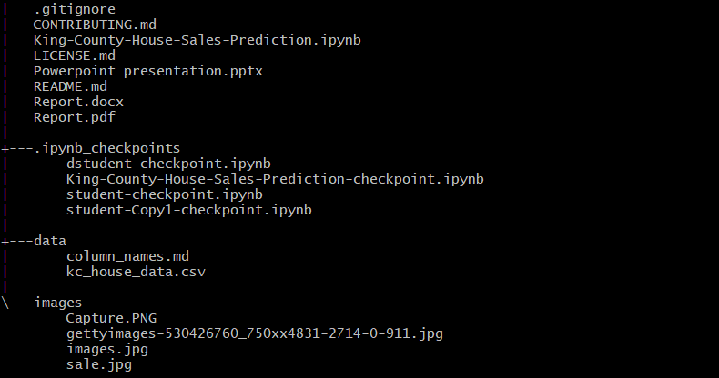

# Kings County House Sales Prediction

#### Authors: Maureen Kitanga, Samuel Kyalo, Priscila Kamiri, Leo Kariuki, Jimcollins Wamae & Steve Githinji

## Overview
Real estate developers are interested in identifying factors that influence the sale price of homes in King County, as well as developing models to predict the sale price of homes based on these factors. This information can be used to optimize the design and marketing of new properties, identify investment opportunities, and make data-driven decisions about the development and sale of properties. To predict the sale price of homes, we used statistical and regression models. From the final model, bathroom and living space area were associated with the highest increase in sale price. Compared to zipcode 98103, zipcode 98004 had the highest increase in home price of $462,900.

## Business Problem
The stakeholder is a Real Estate Developer in a northwestern county who identifies and acquires land for new development projects, as well as oversees the construction process from start to finish. The Real Estate developer want to gain market insights that will lead to an increase in house sales. The objectives were to identify house features with the highest influence on the price, identify how size of the property influences the sale price and 

## Data
This project uses the King County House Sales dataset. The dataset contains information on over 21,000 home sales in King County, Washington, USA between May 2014 and May 2015. The dataset includes a variety of features such as the number of bedrooms and bathrooms, the size of the property, the location of the property, and various other attributes that may influence the sale price of a home, indentify how house neighborhood affects the price and see how accurately we can predict the sale price of homes in King County.

## Methods
The project was done on a jupyter notebook using Python programming language. 
The packages used were:
1. pandas
2. numpy
3. matplotlib
4. seaborn
5. statsmodel
6. sklearn
7. folium
8. plotly

Two multiple linear regressions model were built with a baseline simple linear regression with 'prices' used as the target.

## Results

The results showed that:

1. A one-unit increase in the number of bathrooms is associated with an increase of $16,410.00 in home price.
2. A one-unit increase in square metre of living space is associated with an increase of $ 2813.50 in home price.
3. A one-unit increase in square metre of the lot size is associated with a increase of $ 2.9292 in home price.
4. A one-unit increase in the square metre of the basement is associated with an decrease of $ 663.40 in home price.
5. A one-unit increase in the year the home was built is associated with a decrease of $ 838.71 in home price.
6. Compared to zipcode_98103, zipcode_98004 has the highest increase of $462,900 in home price.
7. Compared to zipcode_98103, zipcode_98092 has the highest decrease of $381,700 in home price.

## Conclusions
Multiple Linear Model 2 was chosen as the final model. This is beacause it explained about 74 % of the variance in price, about 10% more than Multiple Linear Model 1. It also had a lower Mean Absolute Error, by about $ 32,000.

From the final model, bathroom is associated with bringing the highest increase in sale price.

An increase in sqm_living count by 1 unit had the second highest associated increase in price.

Compared to zipcode_98103, zipcode_98004 has the highest increase of $462,900 in home price.

When building new houses, The Real Estate Developer should therefore prioritize:

increasing the number of bathrooms,
consider the size(square meters) of the living space
consider building houses in the postal area of zipcode_98004
Our final model prediction of the house prices is off by about $109,000.

The study had drawbacks in that it had many missing values.

### Next Steps

A further study may be required with a larger dataset for better insights.  Overall, we can have confidence in the validity of the results obtained from this study, but further work is necessary to enhance the accuracy of the predictions. A further study may be required with a larger dataset for better insights.

## For More Information

See the full analysis in the [Jupyter Notebook](https://github.com/stevegithinji/King-County-House-Sales-Model/blob/master/King-County-House-Sales-Prediction.ipynb) or review this [presentation](https://github.com/stevegithinji/King-County-House-Sales-Model/blob/master/Powerpoint%20presentation.pptx).

## Repository Structure

